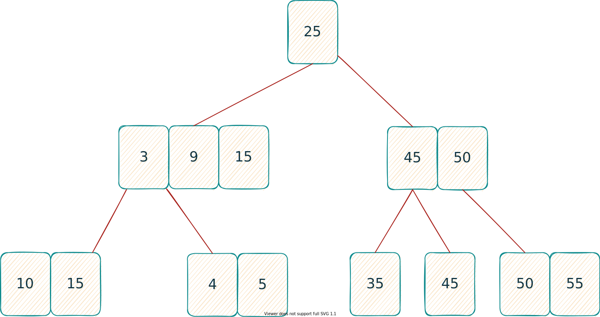

Generalized and ordered BST, where each node contains children as linked list, rather than just elements.

It is used for data storage and access in hard disks.

{ loading=lazy }

| Feature            |                        Formula                        |
| ------------------ | :---------------------------------------------------: |
| Order              |                          $n$                          |
| Max No of Children |                          $n$                          |
| Max No of Keys     |                         $n-1$                         |
| Middle element     | $\left \lceil \dfrac{n}{2} \right \rceil$^th^ element |

==There is no minimum for B Tree.==

## Direction

It is grown in an upward direction, because

- insertion occurs only in the leaf nodes
- ensure balanced tree (as it will be hard to balance once the B Tree is already built)

## Limitations

It has high space complexity, as many locations are empty.

## Complexity

|  Operation  |   Compexity   |
| :---------: | :-----------: |
| Restructure |    $O(1)$     |
|   Search    | $O(\log_2 n)$ |
|  Insertion  | $O(\log_2 n)$ |
|  Deletion   | $O(\log_2 n)$ |