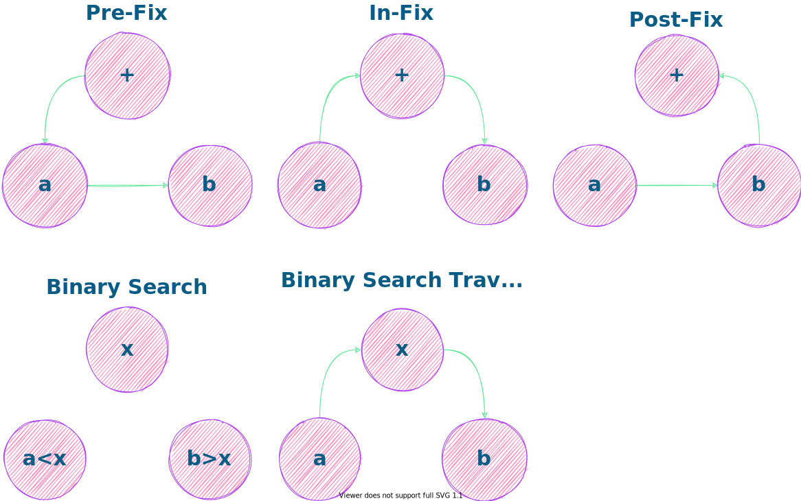

## Trees

is a simple graph such that there is a unique simple non-directed path (which are not closed) between each pair of vertices

1. always connected
2. no cycles/circuits

order of tree $= |V|$

### Properties

1. Trivial tree is a graph with one vertex
2. In every non-trivial tree, there is at least 2 vertices of degree 1
3. A tree with n vertices has exactly $(n-1)$ edges
4. If 2 non-adjacent vertices of a tree T are connected by adding an edge, then the resulting graph will contain a cycle; hence, no more a cycle
5. G is a tree $\iff$ G has no cycles and $|E| = |V| - 1$

### Rooted Trees

is a tree in which there is one designated vertex called as the root

level(root) = 0; index(root) = 1

### Directed Tree

is a rooted tree containing a root from which there is a directed path to each vertex

contains hierarchical levels, measured by no of edges away from the root

level of a path = length of the path required to reach the vertex from the root

### Spanning Tree

Tree containing all vertices of source graph, and minimum required edges to span the entire graph.

It is a subgraph of G

It is obtained by removing cycles

Height of spanning tree = max level

### Minimum Spanning Tree

spanning tree with minimum sum of weights

## Finding Spanning Tree

for small trees, we can perform directly; we need to use algorithms for large trees

(check mail of Tut 7)

### Depth-First search/Back-Track algorithm

(write T={} step-by-step and backtracking)

1. pick an arbitrary vertex as the root
2. add 1 adjacent vertex and edge at a time
   1. avoid formation of cycles
   2. if you come across something that contradicts, perform backtrack

### Breadth-First Search algorithm

1. pick an arbitrary vertex as the root
2. add multiple adjacent vertices and edges (try to get more vertices with max edges)

### Prim’s Algorithm

used for weighted spanning graphs
Eg: GMaps

1. start with minimum edge (e,f)
2. select next minimum edge, which is incident to the either vertex of the starting edge
   1. if you have 2 edges with the same priority, take the alphabetically
   2. then add the other ones too after the above one

### Kruskal’s Algorithm

1. start with minimum edge
2. do minimum edges that aren’t even incident(don’t connect them you dummy), making sure that you don’t get cycles

Independent of starting address

### Prim vs Kruskal

|                           |           Prim            |    Kruskal    |
| ------------------------- | :-----------------------: | :-----------: |
| Starting Edge             |             ✅             |       ❌       |
| Chooses ___ at every edge | nearest/cheapest neighbor | cheapest edge |
| Better for ___ graph      |          Denser           |    Sparse     |
| Insertion of vertices     |             👍             |       👎       |
|                           |                           |               |

Pr***i***m - start***i***ng edge

Krusk***a***l - ***a***ny

## Trees terminology

### Cut edge/Bridge

The edge you remove which makes the graph disconnected

### Cut Vertex

The vertex you remove which makes the graph disconnected (obviously, even the edges associated with the vertex is also removed)

### Branch/Internal Vertex

Vertex with degree > 1

### Leaf/Terminal Vertex

vertex with degree 1

## Forest

Any graph without cycles

need not be connected graph

All trees are forest; **not** vice-versa
Trees are components of forest

## Parts of Rooted Directed Tree

- Root
- Children
- Parents
- Descendants
- Ancestors
- Leaves
- Branches

## Binary Tree

tree where every vertex has at most 2 children

### Regular Binary Tree

tree where every vertex has 0 or 2 children

## Ordering

Labels are given to edges

- Left edge = 0
- Right edge = 1

### Binary String equivalent of a node

1. Write edge ordering from the root to the node
2. Add 1 as MSD

## Level-order indexing

Root $\to 1$ (different from level; level of root is 0)

other vertices are designated as (assuming index of parent = p)

- left child $\to 2p$ 
- right child $\to 2p + 1$

however, for irregular binary tree, some indices might be skipped

### Level of a node

if $i$ is the index of a node

Level = floor($\log i$)
(ie, lower integer value)

## Complete Binary Tree

consider a binary with $|V|=n$

if the index set of a binary tree is $[1,n]$, then the binary tree is called as a complete binary

### Characteristics

1. Regular
2. Ordered

### Fields

1. Data science
2. Searching
3. Efficient Logic and Computing
   1. eliminates the need for parenthesis

## Operation/Expression Tree

Mathematical operations and expression can be represented

consists of

1. operators (branches)
2. operands (leaves)

## Traversal Algorithms

### Pre-order traversal

polish expression

basically prefix

$a+b \to +ab$

Algorithm

1. Visit the root
2. recursively traverse the left subtree
3. recursively traverse the right subtree

### Post-order traversal

Reverse-polish expression

basically post-fix

$a+b \to ab+$

Algorithm

1. Visit the root
2. recursively traverse the right subtree
3. recursively traverse the left subtree

### In-order traversal

basically in-fix

$a+b$

Algorithm

1. recursively traverse the left subtree
2. Visit the root
3. recursively traverse the right subtree

## Binary Search Tree

Sort Tree

every node has a value called as key

has parent, left child, right child

#### Properties

1. left key < parent key
2. Right key > parent key

## Diagram

{ loading=lazy }
