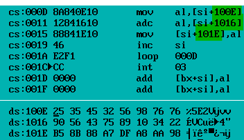

## Program 1

Write a program to add two multi-byte binary numbers stored in memory and also store the result in memory.

```assembly
.MODEL SMALL ; Type of the model declaration
.STACK 20 ; size of the stack declaration
.DATA ; Data segment declaration
org 1000H ; Memory address initialization. Data start from memory Location

; 1006 (it may vary, depends upon your processor)

NUM1 DB 25H,35H,45H,32H,56H,98H,76H,76H ; These are array of 8 hex numbers
NUM2 DB 90H,56H,43H,75H,89H,10H,34H,22H ; These are second array of numbers
ANS DB 10 DUP (?) ; Size of the memory to store the results, it reserves 10 duplicate no. with unknown value.

COUNT DW 8H ; counter to store 8, since 8 times we need to add

.CODE ; code start here
START:
MOV AX, @DATA
MOV DS, AX ; Initializing DS: segment register
MOV CX, COUNT ; Register CX is initializing to COUNT= 8
MOV SI, 0H ; Initializing Source Index Register SI= 0
CLC ; Clears the Carry Flag before addition
REPEAT: ; initializing the loop

; (REPEAT is a loop name, you may change it to any)

MOV AL, NUM1 [SI] ; Loading the 1st array value to AL register
ADC AL, NUM2 [SI] ; Adding the 2nd array value to AL register value
MOV ANS [SI], AL ; moving the addition value to ANS variable
INC SI ; incrementing the Source Index for the next position
LOOP REPEAT ; go back to the location of REPEAT loop
INT 3 ; Breakpoint interrupt
END START ; stopping the program
```

{ loading=lazy }

## Program 2

Write a program to subtract two multi-byte binary numbers stored in memory and also store the result in memory.

```assembly
.MODEL SMALL ; Type of the model declaration
.STACK 20 ; size of the stack declaration
.DATA ; Data segment declaration
Org 1000H ; Memory address initialization. Data start from memory location 1006

; (it may vary, depends upon your processor)

NUM1 DB 89H,35H,45H,32H,56H,98H,76H,76H; These are array of 8 hex numbers
NUM2 DB 32H,56H,43H,75H,89H,10H,34H,22H; These are second array of numbers
ANS DB 9 DUP(0) ; size of the memory to store the results, it reserves 9 duplicate no. with ‘0’ value.

COUNT DW 8H ; counter to store 8, since 8 times we need to subtract
.CODE ; code start here
START:
MOV AX, @DATA
MOV DS, AX ; Initializing DS: segment register
MOV CX, COUNT ; Reg CX is initializing to COUNT=8
MOV SI, 0H ; Initializing Source Index Register SI=0
CLC ; Clears the Carry Flag before subtraction
REPEAT: ; Initializing the loop
MOV AL, NUM1 [SI] ; Loading the 1st array value to AL register
SBB AL, NUM2 [SI] ; subtracting the 2nd array value to AL register value
MOV ANS [SI], AL ; moving the subtracted result to ANS variable
INC SI ; incrementing the Source Index for the next position
LOOP REPEAT ; loop repeat
INT 3 ; Breakpoint interrupt
END START ; stopping the program
```

{ loading=lazy }

## Program 3

Write a program to multiply two 8-bit binary numbers stored in memory and also store the result in memory (both unsigned and signed operation).

- Unsigned numbers stored only positive numbers but not negative numbers
- Signed numbers contain sign flag

```assembly
.MODEL SMALL
.STACK 20
.DATA
ORG 1000H
N1 DB 35H ; Input Number one
N2 DB 82H ; Input Number two
Un_Sign_PROD DW ? ; This the variable to store Unsigned multiplication
Sign_PROD DW ? ; This the variable to store Signed multiplication
.CODE ; code segment start here
START:
MOV AX, @DATA ; Initialize DS
MOV DS, AX
MOV AL, N1 ; storing the first value (N1)to AL
MUL N2 ; Unsigned multiplication, multiplying the N2 with N1
MOV Un_Sign_PROD, AX ; moving the results of AX to Un_sign_Prod variable
MOV AL, N1 ; storing the first value (N1) to AL
IMUL N2 ; Signed multiplication, IMUL multiplies signed numbers
MOV Sign_PROD, AX ; moving the results from AX to sign_PROD variable memory
INT 3 ; Breakpoint interrupt
END START ; stopping the program
```

{ loading=lazy }

## Assignment

Write a program to find factorial of number.

```assembly
.model small
.stack 20
.data
org 1000h

num dw 6d
fact dw 1d

.code
start:
mov dx, @data
mov ds, dx
mov cx, num
mov si, 0h
mov ax, 1d

repeat:
mul cx
loop repeat

mov fact, ax

int 3
end start
```

{ loading=lazy }