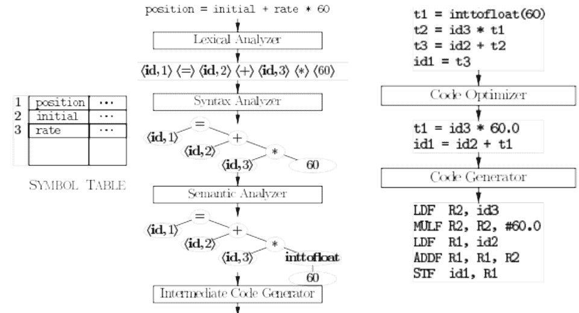

## Language Translators

You should know by this stage :/

If you don’t, refer [this](./../../3_Core/Principles_of_Programming_Languages/01_Intro.md#language-translators).

## Programming Language Processing

```mermaid
flowchart LR
a(( )) -->
|Source<br/>Program| Preprocessor -->
|Modified<br/>Source<br/>Program| Compiler -->
|Target<br/>Assembly<br/>Code| Assembler -->
|Relocatable<br/>Machine<br/>Code| Linker/Loader -->
|Target<br/>Machine<br/>Code| b(( ))
```

**Compiler outputs assembly code**, as it is easier to

- produce as output
- debug

Linker resolves ext mem addresses, where code in one file may refer to location in another file.

## Stages of Compiler

```mermaid
flowchart LR

a[/Input/] -->
|Char<br/>Stream| la

subgraph Analysis/Front End
la["Lexical<br/>Analysis<br/>(Scanning)"] -->
|Token<br/>Stream| sya["Syntax<br/>Analysis<br>(Parsing)"] -->
|Syntax<br/>Tree| sea[Semantic<br/>Analysis]
end

sea --> |Syntax<br/>Tree| icg

subgraph Synthesis/Back End
icg[Intermediate<br/>Code<br/>Generation] -->
|Intermediate<br/>Representation| mico[Machine-Independent<br/>Code Optimization] -->
|Intermediate<br/>Representation| c[Code<br/>Generator] -->
|Target<br/>Machine<br/>Code| mdco[Machine-Dependent<br/>Code Optimization]
end

mdco --> o[/Output/]
```

| Stage                                                        | Input                             | Task                                                         |
| ------------------------------------------------------------ | --------------------------------- | ------------------------------------------------------------ |
| [Lexical<br />Analysis](02_Lexical_Analysis.md)/<br />Scanning | Source prog                       | - Group characters into lexemes (meaningful sequences)<br/>- Generate a token for every lexeme<br/>- Access/Update symbol table<br/><br/>Secondary<br/>- Stripping comments, whitespaces (blanks, newlines, tokens)<br/>- Keep track of line number for errors<br/>- Macro expansion |
| [Syntax<br />Analysis](03_Syntax_Analysis.md)/<br />Parsing  | Tokens                            | - Check if structure follows [context-free] grammar of lang<br/>- Creates tree representationof grammatical structure of token stream |
| [Semantic<br />Analysis](04_Semantic_Analysis.md)            | Syntax tree<br />Symbol table     | - Check semantic consistency w/ lang definition<br/>- Gathers type information & saves it in syntax tree/symbol table<br/>- Type checking: each operator has matching operands<br />- Label Checking<br />- Keywords misuse<br />- Flow Control checking (no `break` outside loop)<br/>- Type conversions called [coercions](04_Semantic_Analysis.md#coercions) |
| [Intermediate<br />Code<br />Generation](05_Intermediate_Code_Generation.md) | Parse tree from semantic analyzer | Generate program in low-level/machine-like intermediate representation |
| [Code<br />Optimization](06_Code_Optimization.md)            | Intermediate code                 | Improve code so that target code uses lesser resources       |
| [Code<br />Generation](07_Code_Generation.md)                | Intermediate representation       | - Produces target language (machine/assembly code)<br/>- Choose registers & mem locations for vars in prog |



## Error Detection & Reporting

At every phase, if any error is identified, it is reported and handled

### Tasks

- Report the presence of errors clearly & accurately. One error can mask another & cause correct code to look faulty. 
- Recover from each error quickly enough to detect subsequent errors
- Add minimal overhead to processing of correct programs

### Types of Errors

| Types    | Meaning                              | Example                                                      |
| -------- | ------------------------------------ | ------------------------------------------------------------ |
| Lexical  | Misspelled identifier/keyword        | `fi (a == b)`<br />(`fi` could be identifier/misspelled keyword (`if`)/function name<br />But lexical analysis considers it as identifier) |
| Syntax   | Statement not following lang rules   | Missing `;`<br />Arithmetic expression with unbalanced parenthesis |
| Semantic |                                      | Divide by 0<br />Operation incompatible operand types<br />Wrong number of array index |
| Logical  | No rules broken, but incorrect logic | Using < instead of <=<br />Infinite recursive call           |

## Symbol-Table 

Data structure (usually hash table - for efficiency) containing a record for each identifier (variables, constants, functions) with fields for the attributes of the identifier

It is accessed at every phase of compiler.

- Scanner, parser, and semantic analyzer put names of identifiers in symbol table.
- The semantic analyzer stores more information (e.g. types) in the table.
- The intermediate code generator, code optimizer and code generator use information in symbol table to generate appropriate code.

### Contains

- Attributes of variables are name, type, scope, etc.
- Attributes of procedure names which provide info about
  - no and types of its arguments
  - method of passing each argument (call by value/reference)
  - type returned


## Passes

Several phases are sometimes combined into a single ‘pass’

A pass reads an input file process it and writes an output file

### Normal Passes in Compilers

- Front-end phases are combined into a pass
- Code optimization is an optional pass 
- Back-end phase can be made into a pass

## Misc

### Compilation Examples

#### C

```bash
cc gx.c
objdump -d a.out
```

#### Java

This command shows how your class file is treated

```bash
javac File.java
javap -c File.class
```

It is cross platform, as it executes as a station machine

#### Python

```bash
python file.py
python decompile file.py
```

### Android SDK

How does it show how your java program will work on mobile, when mobile is ARM architecture, but your laptop is usually x86 architecture.

This is because java program is cross-platform, and the simulator simulates execution of the program as if it is executed on an ARM processor.