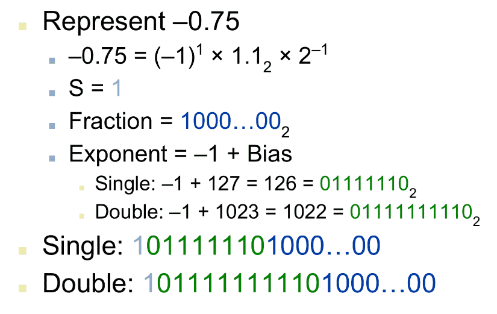
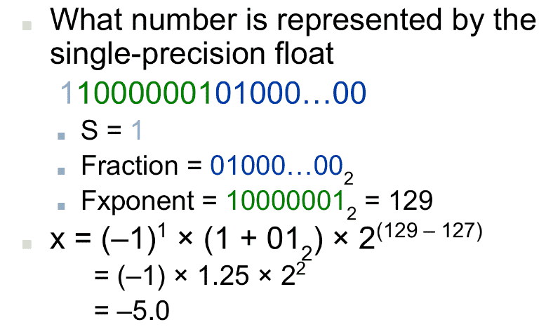
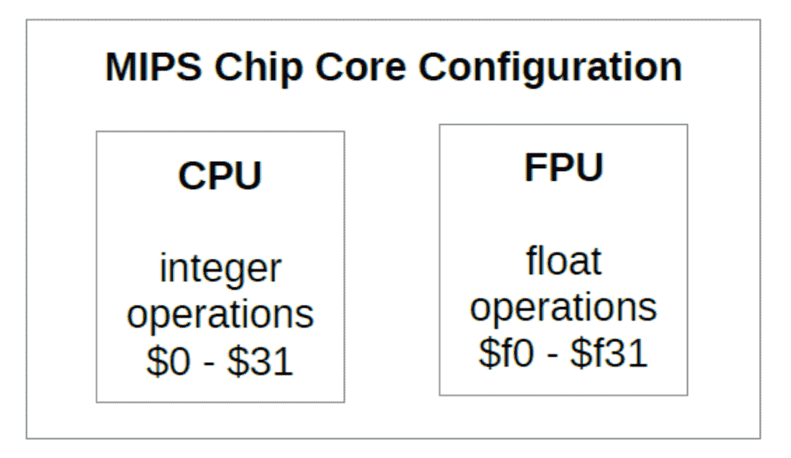
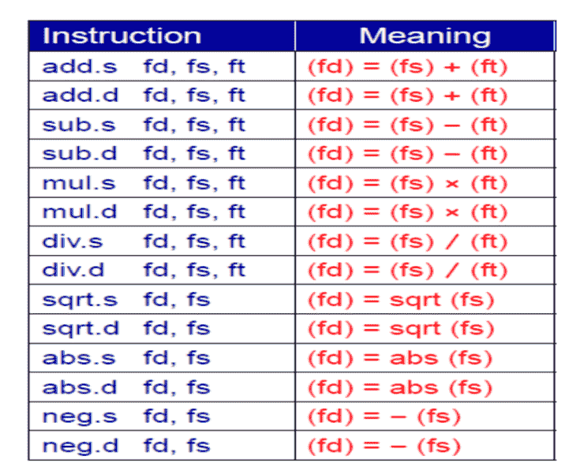
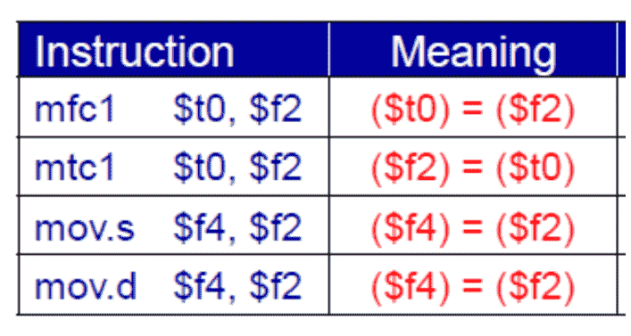
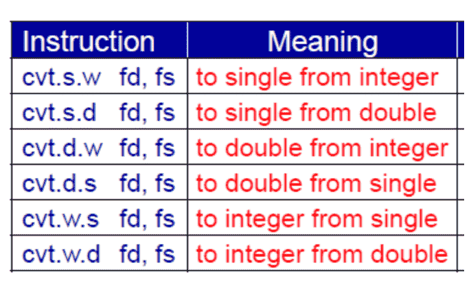
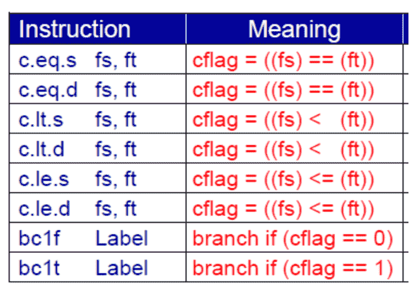

## Floating Point

{ loading=lazy }

$$
x =
(-1)^s \times
(1.\text{Fraction}) \times
2^{\text{Exponent - Bias}}
$$

### S

- Sign bit
- 0: non-negative
- 1: negative

### Exponent

- Excess representation: actual exponent + Bias
- Ensures exponent is unsigned
- Single: Bias = 127; Double: Bias = 1023

### Normalized Significand

- Significand is Fraction with the `1.` restored
- $1.0 \le |\text{significand}| < 2.0$
- Always has a leading pre-binary-point 1 bit, so no need to
represent it explicitly (hidden bit)

## Single Precision (32-bit)

Exponents $00000000$ and $11111111$ reserved

|                 | Smallest value                      | Largest value                       |
| --------------- | ----------------------------------- | ----------------------------------- |
| Exponent        | 00000001                            | 11111110                            |
| actual exponent | –126                                | +127                                |
| Fraction        | 000…00                              | 111…11                              |
| significand     | 1.0                                 | 2.0                                 |
| Value           | $±1.0 × 2^{–126} ≈ ±1.2 × 10^{–38}$ | $±2.0 × 2^{+127} ≈ ±3.4 × 10^{+38}$ |

## Double Precision (64-bit)

Exponents $0000…00$ and $1111…11$ reserved

|                 | Smallest value                        | Largest value                         |
| --------------- | ------------------------------------- | ------------------------------------- |
| Exponent        | 00000000001                           | 11111111110                           |
| actual exponent | –1022                                 | +1023                                 |
| Fraction        | 000…00                                | 111…11                                |
| significand     | 1.0                                   | 2.0                                   |
| Value           | $±1.0 × 2^{–1022} ≈ ±2.2 × 10^{–308}$ | $±2.0 × 2^{+1023} ≈ ±1.8 × 10^{+308}$ |

## Floating Point Examples

{ loading=lazy }

{ loading=lazy }

## Denormal Numbers

Exponent = 000...0 ⇒ hidden bit is 0

$$
x = (-1)^s \times (0+\text{Fraction}) \times 2^{-\text{Bias}}
$$

- Smaller than normal numbers
- Allow for gradual underflow, with diminishing precision

Denormal with fraction = 000...0 is $\pm 0.0$
(2 representations of $0.0$)

## Infinities and `NaN`s

|                                        | $\pm \infty$                   | `NaN`                                                    |
| -------------------------------------- | ------------------------------ | -------------------------------------------------------- |
|                                        | Infinity                       | Not-A-Number                                             |
| Exponent                               | $111 \dots 1$                  | $111 \dots 1$                                            |
| Fraction                               | $000 \dots 0$                  | $\ne 000 \dots 0$                                        |
| Can be used in subsequent calculations | ✅                              | ✅                                                        |
|                                        | Avoids need for overflow check | Indicates illegal or undefined result<br />For eg: $0/0$ |

## Floating-Point Addition

1. Align binary points
   Shift number with smaller exponent
2. Add significands (in binary)
3. Normalize result & check for over/underflow
4. Round and renormalize, if necessary

## FP Adder Hardware

Much more complex than integer adder

Doing it in one clock cycle would take too long

- Much longer than integer operations
- Slower clock would penalize all instructions

FP adder usually takes several cycles

- Can be pipelined

## MIPS Floating Point Instructions

{ loading=lazy }

FPU co-processor is an adjunct processor that extends the ISA

Separate FP registers

- 32 single-precision: `$f0, $f1, … $f31`
- Paired for double-precision: `$f0/$f1, $f2/$f3,`

FP instructions operate only on FP registers

- Programs generally don’t do integer ops on FP data, or vice versa
- More registers with minimal code-size impact

Separate FP instructions for single/double precision

| Precision | Bits | Instruction Extension | Example                                                      |
| --------- | ---- | --------------------- | ------------------------------------------------------------ |
| Single    | 32   | `.s`                  | `add.s $f0, $f1, $f2`                                        |
| Double    | 64   | `.d`                  | `add.d $f0, $f2, $f4`<br />(equivalent to`add.d $f0/$f1, $f2/f3, $f4/$f5`) |

### FP Arithmetic Operations

{ loading=lazy }

### FP Load/Store

|        |                            |
| ------ | -------------------------- |
| `lwc1` | load word coprocessor 1    |
| `ldc1` | load double coprocessor 1  |
| `swc1` | store word coprocessor 1   |
| `sdc1` | store double coprocessor 1 |

{ loading=lazy }

### FP Load/Store pseudo Instructions

|       |      |                 |
| ----- | ---- | --------------- |
| `l.s` | lwc1 | load FP single  |
| `s.s` | swc1 | store FP single |
| `l.d` | ldc1 | load FP double  |
| `s.d` | sdc1 | store FP double |

### FP Loading immediate value

(pseudoinstruction)

```assembly
li.s $f1, 1.0

li.s $f10, 1.0e-5 ## $f10 = 0.00001
```

### FP Data Movement Instructions

Moving data between general purpose and FP registers

|                                                          |         |                                                          |
| -------------------------------------------------------- | ------- | -------------------------------------------------------- |
| Moving data between general purpose and<br/>FP registers | `mfc1`  | move from coprocessor 1 (to general purpose register)    |
|                                                          | `mtc1`  | move to coprocessor 1 (from general purpose register)    |
| Moving data between FP registers                         | `mov.s` | move single precision float                              |
|                                                          | `mov.d` | move double precision float = even/odd pair of registers |

{ loading=lazy }

## FP Convert Instructions

`m.x.y`

Convert

- **to** destination format $x$
- **from** source format $y$

### Supported Formats

- Single precision float = `.s` (single precision float in FP register)
- Double precision float = `.d` (double float in even-odd FP register)
- Signed integer word = `.w` (signed integer in FP register)

{ loading=lazy }

## FP Compare and Branch Instructions

FP unit (co-processor 1) has a condition flag

- Set to 0 (false) or 1 (true) by any comparison instruction

Three comparisons

- equal, less than, less than or equal

Two branch instructions based on the condition flag

{ loading=lazy }

## Reading and printing single and double values

{ loading=lazy }

## Floating-Point Data Declarations

```assembly
.data
pi: .float 3.14
tao: .double 6.28

.text
main:
	
end main
```

## MIPS Floating Point Examples

### Area of Circle

```assembly
.data
pi: .double 3.14

.text
main:
	#f2,f3 = pi
	ldc1 $f2, pi

	## read double (radius)
	addi $v0, $zero, 7
	syscall ## f0, f1 = r
	
	mul.d $f12, $f0, $f0 ## r^2
	mul.d $f12, $f2, $f12 ## area = pi * r^2
	
  ## print value
  addi $v0, $zero, 3
  syscall
```

### °F $\to$ °C

```assembly
.data
const5: .float 5.0
const9: .float 9.0
const32: .float 32.0
constf: .float 50.0

.text
main:
l.s $f16, const5
l.s $f18, const9
div.s $f16, $f16, $f18
l.s $f12, constf
l.s $f18, const32
sub.s $f18, $f12, $f18
mul.s $f12, $f16, $f18
li $v0, 2
syscall
li $v0, 10
syscall
```

### $ax^2 + bx + c$ for user-inputted $x$

```assembly
.data
a: .float 1.0
bb: .float 2.0
c: .float 3.0
msg: .asciiz "Enter x: "
blank: .asciiz " "
newl: .asciiz "\n"

.text
main: ## read input
la $a0,msg ## prompt user for x
li $v0,4 ## print string
syscall
li $v0,6 ## read single
syscall ## $f0 <-- x

## evaluate the quadratic
l.s $f2,a ## sum = a
mul.s $f2,$f2,$f0 ## sum = ax
l.s $f4,bb ## get b
add.s $f2,$f2,$f4 ## sum = ax + b
mul.s $f2,$f2,$f0 ## sum = (ax+b)x = ax^2 +bx
l.s $f4,c ## get c
add.s $f2,$f2,$f4 ## sum = ax^2 + bx + c

## print the result
mov.s $f12, $f2 ## $f12 = argument
li $v0,2 ## print single
syscall
la $a0,newl ## new line
li $v0,4 ## print string
syscall
li $v0,10 ## code 10 == exit
syscall ## Return to OS.
```
