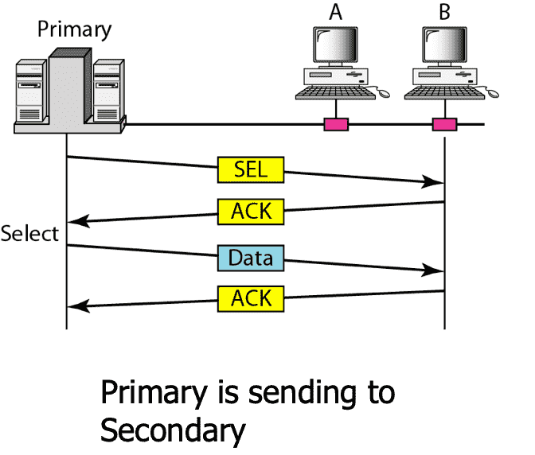
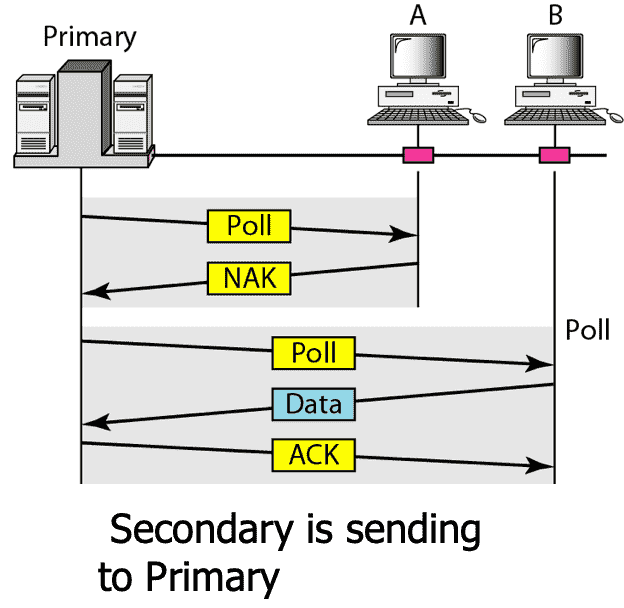

(please complete from slides)

## Reservation Method

Priority is given to each station

Reservation frames are used by stations to ‘reserve access’. Size of reservation frame (in bits) will be equal to number of stations in the network.

- Stations take turns transmitting a single frame at a full rate $R$ bps
- Transmissions are organized into variable length cycles
- Each cycle begins with a reservation interval that consists of $N$ minislots. One minislot for each of the $N$ stations.
- When a station needs to send a data frame, it makes a reservation in its own minislot.
- By listening to the reservation interval, every station knows which stations will transfer frames, and in which order.
- The stations that made reservations can send their data frames after the reservation frame

## Polling

|                      | Primary Station | Secondary Station |
| -------------------- | :-------------: | :---------------: |
| Example              |     Servers     |      Clients      |
| Permission to select |        ✅        |         ❌         |

Polling by primary station keeps switching between secondary stations at a certain polling rate.

Stations take turns accessing the medium

### Types

| Centralized Polling                                          | Distributed Polling                                          |
| ------------------------------------------------------------ | ------------------------------------------------------------ |
| - One device is assigned as primary station and the others as secondary stations - All data exchanges are done through the primary - When the primary has a frame to send it sends a select frame that includes the address of the intended secondary - When the primary is ready to receive data it send a Poll frame for each device to ask if it has data to send or not. If yes, data will be transmitted otherwise NAK (Negative AcKnowledgement) is sent. - Polling can be done in order (Round-Robin) or based on predetermined order | - No primary and secondary - Stations have a known polling order list which is made based on some protocol - station with the highest priority will have the access right first, then it passes the access right to the next station (it will send a pulling message to the next station in the pulling list), which will passes the access right to the following next station, … |
|  |                                                              |
|  |                                                              |

## Token-Passing

Requires ring topology

```mermaid
flowchart TB
start([Start]) -->
token["Wait for<br/>Token"] -->
ct[/"Capture<br/>Token"/] -->
dfts{"Data frame<br/>to send?"}

dfts -->
|Yes| send[/"Send<br/>Frame"/] -->
ate{"Allocated Time<br/>Expired"} -->
|No| dfts

dfts --> |No| e
ate --> |Yes| e


e((" ")) -->
rt["Release Token<br/>(Next station takes token)"] -->
stop([Stop])
```

