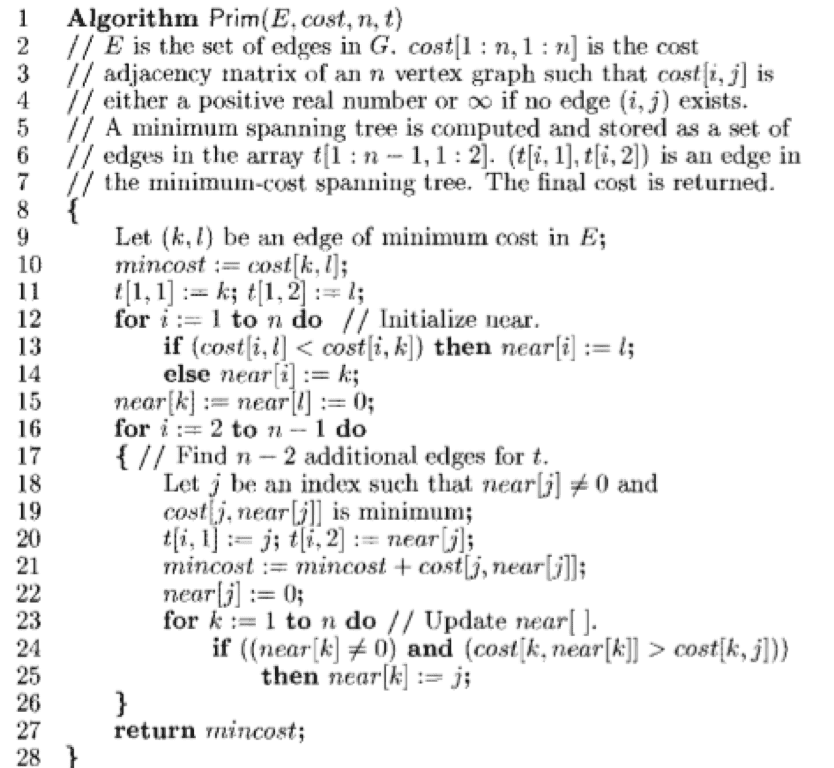

A greedy algorithm solves problems by making the choice that appear to be the best at that particular moment.

## Prim’s Algorithm

Refer [Discrete Structures](./../../2_Core/Discrete_Structures/05_Trees.md#prims-algorithm)

- With cost matrix $O(n^2)$
- With heaps $O\Bigg( (n + |E|) \log n \Bigg)$

I didn’t understand the code implementation



## Knapsack Problem

There exists items, with each having

- profit $p_i$
- weight $w_i$

There also exists a limit $m$ which is the max weight you can pick

### Goal

maximize profit $P$, while adhering to the limit.
$$
\begin{aligned}
\text{max } P = &\sum p_i x_i \\
\text{such that} &\sum w_i x_i \le m
\end{aligned}
$$

### Steps

1. Convert list of $p_i$ and $w_i$ into a new list of $p_i/w_i$
2. Sort in descending order

### Algorithm

```pseudocode
// this is for x_i = 0 or 1 (binary)

Algorithm GreedyKnapsack(p, w, m, n)
{
	Input
		- Profit array (sorted)
		- Weights array (sorted)
		- max capacity (knapsack size)
		- no of objects
		
	for i=1 to n
		x[i] = 0
		
	remaining_cap = m

	for i=1 to n
		if(w[i] < remaining_cap)
			x[i] = 1
			remaining_cap -= w[i]
		else
			break
	
	if (i<=n)
		x[i] = remaining_cap/w[i]
}
```

### Types

| Type                        |                                                              | Example |
| --------------------------- | ------------------------------------------------------------ | ------- |
| 0/1<br />(Discrete)         | An item can be<br />- not taken<br />- completely taken      | Phone   |
| Fractional<br />(Continous) | An item is can be<br />- not taken<br />- partially taken<br />- completely taken | Juice   |

## Tree Vertex Splitting

Directed and weighted binary tree

[Nice video](https://youtu.be/6SmXW2u5lEo)

### Steps

1. Traverse from bottom
2. Split a node from the tree if $d(u) > \delta$
   - $d(u) = 0$ for leaves
   - $d(u) = \underset{v \in c(u)}{\max} \{ d(v) + w(u, v) \}$
3. Traverse upward

### Example with $\delta=5$

```mermaid
flowchart TB

subgraph After
direction TB
a1((1)) --> a2((2i)) & a3((3))
a2o((2o)) --> a4i((4i))
a4o((4o)) --> a7((7)) & a8((8))

a3 --> a5((5)) & a6i((6i))
a6o((6o)) --> a9((9)) & a10((10))
end

subgraph Before
direction TB
1((1))
2((2))
3((3))
4((4))
5((5))
6((6))
7((7))
8((8))
9((9))
10((10))

1 -->|4| 2
2 --> 0(( ))
2 -->|2| 4
4 -->|1| 7
4 -->|4| 8

1 -->|2| 3
3 -->|1| 5
3 -->|3| 6
6 -->|2| 9
6 -->|3| 10
end
```

```pseudocode
Algorithm TVS(T, w, delta)
{
	if(T != 0)
	{
		d[T] = 0
		
		for each child v of T
		{
			TVS(v, w, delta)
			d[T] = argmax{d[T], d[v] + w(T, v)}
		}
		
		if(
			T is not root
			and
			d[T] + w(parent(T), T) > delta
		)
		{
			write(T)
			d[T] = 0
		}
	}
}
```

## Job Scheduling

Similar to Knapsack problem

There exists jobs, with each having

- profit $p_i$
- deadline $w_i$

To complete each job, it only takes 1 unit of time

Also

- it is not necessary to complete all jobs
- a job can only be taken once

### Goal

maximize profit $P$, while adhering to the limit.
$$
\begin{aligned}
\text{max } P = &\sum p_i x_i \\
\text{such that } & d_i \text{ is not violated}
\end{aligned}
$$

### Step

1. Sort the jobs in descending order based on profit

### Algorithm

```pseudocode
Algo JS(arr, t):
 
    // length of array
    n = len(arr)
 
		sort_desc(arr)
		 
    // To keep track of free time slots
    result = [False] * t
 
    // To store result (Sequence of jobs)
    job = ['-1'] * t
 
    // Iterate through all given jobs
    for i in range(len(arr)):
 
        // Find a free slot for this job
        // (Note that we start from last possible slot)
        for j in range(min(t-1, arr[i][1] - 1), -1, -1):
            // Free slot found
            if result[j] is False:
                result[j] = True
                job[j] = arr[i][0]
                break
 
    // print the sequence
    print(job)
```

