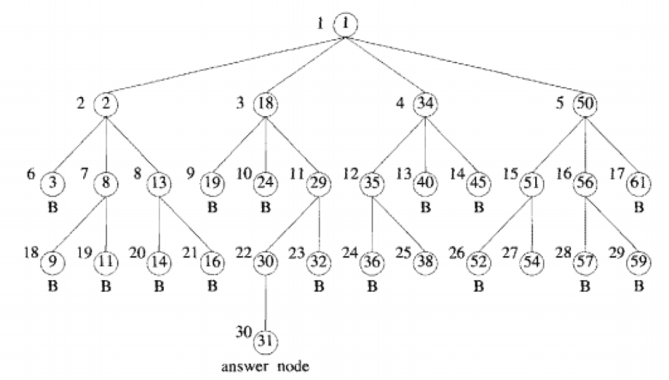
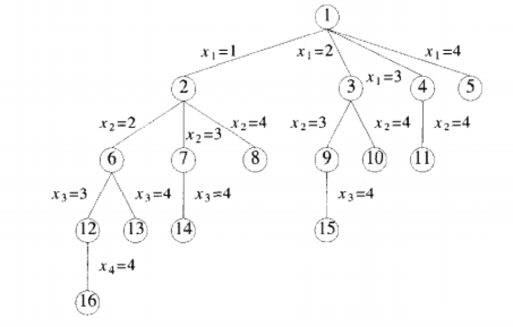
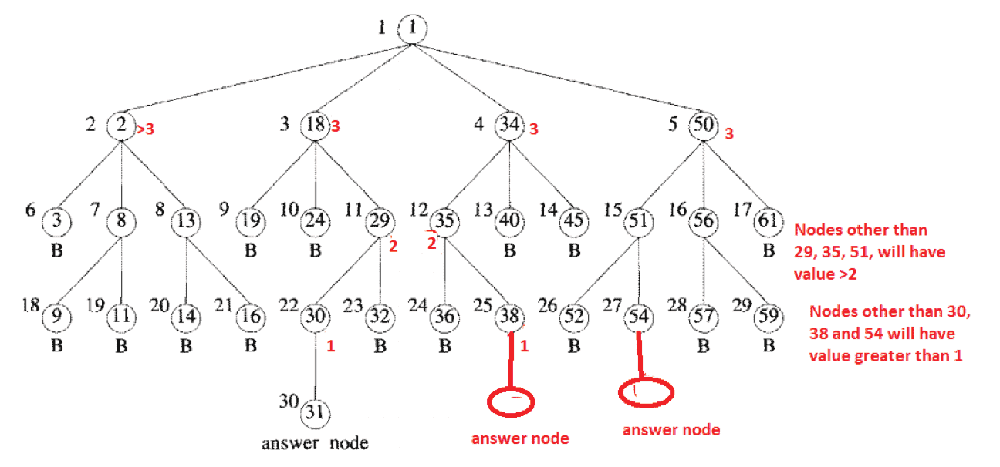

Algorithm that is used for solving combinatorial optimization problems, which usually have exponential time complexity.

Algorithm that is used for solving combinatorial optimization problems, which usually have exponential time complexity.

All children of the E-node are generated before any other live node can become the E-node

Bounding functions are used to help avoid the generation of sub trees that do not contain an answer node

## Types

1. DFS (Stack/FIFO)
2. BFS (Queue/LIFO)
3. Least cost branch and bound

In both LIFO and FIFO types, the selection rule for the next E-node is rigid, resulting in exploring maximum of all the E-nodes consuming more time.

## Least Cost Branch & Bound

Selection of E-node is based on a cost function

Not all the children of a node is generated; only nodes with least cost are expanded

If we are close to the solution, first explore that path completely, instead of partially exploring other paths.

### Cost Function

If Cost measure is used

- search would always generate the minimum number of nodes 
- only nodes to become E-nodes are the nodes on the path from the root to the nearest answer node

The difficulty with using the "ideal" cost functions is that computing the cost of a node will usually involve a search of the subtree X for an answer node.

Hence, by the time the cost of a node is determined, that subtree has been searched and there is no need to explore X again. 

For this reason, search algorithms usually rank nodes based only on an estimated value, ĝ(), of their cost.

#### Formula

$$
\hat c(x) = f\Big(h(x)\Big) + \hat g(x)
$$

where

- $f(x)$ is a non-decreasing function
- $h(x)$ is cost reaching $x$ from root
- $\hat g(x)$ is estimated additonal effort  to reach answer node from $x$
  - $\hat g(y) \le \hat g(x)$, if $y$ is a child of $x$

```mermaid
flowchart TB
r((Root)) -->
|"h(x)"| x((x)) -->
|"ĝ(x)"| a((Answer<br/>Node ))
```

### Cases of Formula

| Case                                  |                  |                                                              |
| ------------------------------------- | ---------------- | ------------------------------------------------------------ |
| $f\Big(h(x)\Big) =0$                  |                  | DFS                                                          |
| $f\Big(h(x)\Big) \ne 0$               |                  | Favor node close to the root over a node which is many levels below, thus reducing possibility of unproductive deep searches into tree |
| $f\Big(h(x)\Big) =$ level of node $x$ | $\hat g (x) = 0$ | BFS                                                          |

### Cases of Cost

| $x$ is answer node | Subtree $x$ has answer node | $\implies$ | $c(x)$                                          |
| :----------------: | :-------------------------: | :--------: | ----------------------------------------------- |
|         ✅          |             N/A             |            | Cost of reaching $x$ from root                  |
|         ❌          |              ✅              |            | Cost of mininum cost answer node in subtree $x$ |
|         ❌          |              ❌              |            | $\infty$                                        |

## Optimization vs Decision Problem

|            | Optimization                       | Decision Problem                                             |
| ---------- | ---------------------------------- | ------------------------------------------------------------ |
| Value Type | Continuous                         | Binary                                                       |
| Example    | Finding the value of shortest path | Finding whether the shortest path in a graph is of length 20 |

## Backtracking vs Branch & Bound

| Parameter  | Backtracking                                                 | **Branch and Bound**                                         |
| ---------- | ------------------------------------------------------------ | ------------------------------------------------------------ |
| Approach   | Find all possible solutions available to a problem. When a wrong choice is made, perform backtracking | Once a better optimal solution is obtained than a pre-solution leads to, it abandons that pre-solution |
| Traversal  | DFS                                                          | DFS BFS                                                 |
| Function   | Feasibility function                                         | Bounding function                                            |
| Problems   | Decision Problem                                             | Optimization Problem                                         |
| Searching  | Until solution is obtained                                   | Tree need to be searched completely                          |
| Efficiency | better                                                       | worse                                                        |

## 4 Queens

### FIFO

### LIFO

### Least Cost

