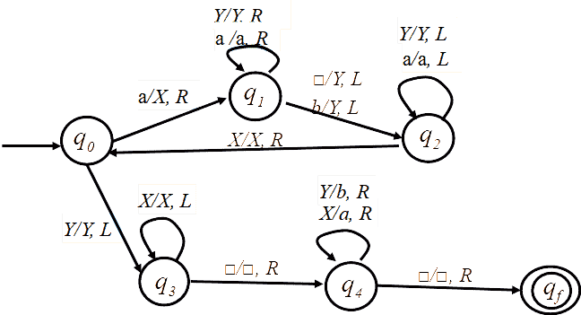

## Cromsky Hierarchy

{ loading=lazy }

## Turing Machine

NFA + Read/Write Capability

- Read/write happens from/to an ‘infinite tape’
- Read-write head can move left and right
- Initially, all cells of the tape have special blank symbol $\square$, except where the input string exists

- FSMs always halt after $n$ steps, where $n$ is the length of the input. At that point, they either accept or reject.
- PDAs don't always halt, but there is an algorithm to convert any PDA into one that does halt.
- Turing machines can do one of the following
  1. Halt and accept
  2. Halt and reject
  3. Not halt 
     If a turing machine loops forever $\implies \not \exists$ algorithm to solve the problem

| Symbol         | Meaning                                                      |
| -------------- | ------------------------------------------------------------ |
| $Q$            | Finite set of states                                         |
| $\Sigma$       | Finite set of input alphabet                                 |
| $\Gamma$       | Finite set of tape alphabet, such that<br />$\square \in \Gamma$<br />$\Sigma \in \Gamma$ |
| $q_0$          | Start state                                                  |
| $q_\text{acc}$ | Accepting state                                              |
| $q_\text{rej}$ | Rejecting state                                              |
| $\delta$       | Transition function<br />$Q \times \Gamma \to Q \times \Gamma \times \text{\{L, R\}}$ |

### Transition in Expression form

$\delta(q_0, a) = (q_1, b, L)$ represents a transition with

- Current state $q_0$
- $a$ is current tape input character
- New state $q_1$
- $b$ is new tape input character
- $L$ is the direction that read-write head moves

### Transition in Diagram Form

`<tape_input>/<tape_write>, <direction>`

```mermaid
flowchart LR
q0((q0)) -->|1/X, R| q1((q1))
```

### Uses

- Language decider/recognizer
    - Yes/No output
    - Halts for correct input
    - May not halt for wrong inputs
- Compute functions
    - Reverse string
    - Computing systems

## Hailstone Sequence

> For example, for a starting number of 7, the sequence is **7, 22, 11, 34, 17, 52, 26, 13, 40, 20, 10, 5, 16, 8, 4, 2, 1, 4, 2, 1**, .... Such sequences are called hailstone sequences because the values typically rise and fall, somewhat analogously to a hailstone inside a cloud.

Suppose we have

(Code not required to be studied)

```c
#include <stdio.h>
int main()
{
  unsigned int n;        
  printf("Pl. enter no :");    
  scanf("%d", &n);    
  
  while ( n > 0 )
  {
    printf( "%d ", n);
    if (n == 1)
      break;
    if (!(n & 1))
      n /= 2;
    else
      n = 3*n + 1;
  }    
  
  printf("Done \n");
  return 0;
}
```

Is there any n for which the program does **not terminate**, ie does not converge to 1? It is inconclusive, as we do not know.

Hence, the turing machine may not halt for this problem.

## Questions

### $0^n 1^n, n \ge 1$

```mermaid
flowchart LR

subgraph Only X
direction LR

q0((q0))
q1((q1))
q2((q2))
q3((q3))
q4((q4))
q5(((q5)))

q0 -->
|0/X, R| q1 -->
|"
0/0, R
X/X, R
"| q1 -->
|1/X, L| q2 -->
|X/X, L| q2 -->
|"0/0, L"| q3 -->
|"0/0, L"| q3 -->
|"X/X, R"| q0

q2 -->
|"&square;/&square;, R"| q0

q0 --->
|"X/X, R"| q4 -->
|"X/X, R"| q4 -->
|"&square;/&square;, R"| q5

end

subgraph Using X & Y
direction LR
p0((q0))
p1((q1))
p2((q2))
p3((q3))
p4(((q4)))

p0 -->
|0/X, R| p1 -->
|"
0/0, R
Y/Y, R
"| p1 -->
|1/Y, L| p2 -->
|"
0/0, L
Y/Y, L
"| p2 -->
|X/X, R| p0 -->
|Y/Y, R| p3 -->
|Y/Y, R| p3 -->
|"&square;/&square;, R"| p4
end
```

### $w w$

Kinda complicated

### $w w^r$

Kinda complicated

### Balanced Parantheses

We first look for closing bracket; The opening bracket for a given closed bracket is always the first one on its left; converse statement is not true.

```mermaid
flowchart LR
q0((q0))
q1((q1))
q2((q2))
q3((q3))
q4(((q4)))

q0 -->
|"
(/(, R
X/X, R
"| q0 -->
|")/X, R"| q1 -->
|"X/X, L"| q1 -->
|"(/X, R"| q0 -->
|"&square;/&square;, L"| q3 -->
|"X/X, L"| q3 -->
|"&square;/&square;, R"| q4

q3 -->|"(/(, R"| q2

q1 -->
|"&square;/&square;, R"| q2
```

### $w\#w: 011\#011$

{ loading=lazy }

### Add $b$ to match $a$, such that $a^n b^n$

{ loading=lazy }

### Convert $w \to w w^r$

Pretty complicated

### Multiplication

Pretty complicated

