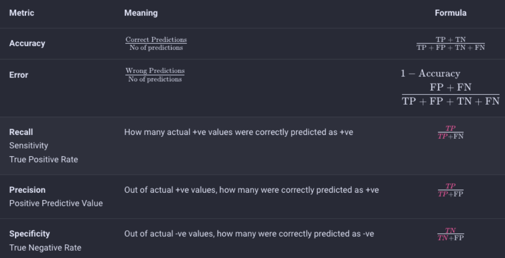

# 📝 Contributing

Welcome to our open-source project! We love your input! We want to make contributing to this project as easy and transparent as possible, whether it's:

- Reporting a Bug
- Discussing the Current State of the Code
- Submitting a Fix
- Proposing New Features
- Becoming a Moderator

We appreciate your interest in contributing to our repository. Before you get started, please take a moment to review the guidelines below.


## 🚀 Guidelines

1. Fork the repository and clone it locally.
2. Create a new branch for your changes.
3. Make your changes and test them locally. All notes must be in markdown only. If you're not familiar with markdown, please refer to [this](https://gdscbpdc.github.io/2022-2023/02_Markdown/).
4. If you're fixing a bug, please include a test case that demonstrates the bug.
5. Submit a pull request (PR) to the `main` branch of the original repository. All pull requests must address an issue. Write clear and concise commit messages and pull request descriptions.
6. Your PR will be reviewed by a moderator. If there are any requested changes, make them and push them to your branch, and your PR will be updated automatically.
7. Once your changes are approved and merged, you can delete your branch.

## 🤔 Issues and Feature Requests

If you find a bug or have a feature request, please open an issue in the repository. Please provide a clear and concise description of the issue or request, and include any relevant information, such as error messages or steps to reproduce.

## 🤩 Introducing new Course (or) new notes?
1. **Fork the repo**:
- Go to the repo on GitHub and click on the "Fork" button in the top right corner.
- This will create a copy of the repository under you GitHub account.

2. **Clone the forked repo**:
- Using your terminal or Command Prompt, navigate to the directory where you want to clone the repo. 
But before, [download & install git](https://github.com/git-guides/install-git) on you machine.
- Then use the following command to clone the repository to you local machine:
```
git clone <forked_repository_url>
```
Replace `<forked_repository_url>` with the URL of your forked repository. You can find this URL in the repository page of your forked repository on GitHub.

3. **Configure upstream remote**:
- Change to the cloned repository's directory using the `cd` command. 
- Then, add the original repository as the upstream remote so that you can *fetch any changes* made to the original repository. 
Use the following command:
```
git remote add upstream <original_repository_url>
```

4. **Create a new branch**: 
- Before making any changes, create a new branch to work on. This keeps your changes separate from the main branch. 
- Use the following command to create a new branch:
```
git checkout -b <branch_name>
```
Replace `<branch_name>` with a descriptive name for your branch.

5. **Add your new files**: 
- Place the new files you want to upload into the cloned repository's directory on your local machine.

6. **Stage the changes**: 
- Use the following command to stage the changes (including the new files) for commit:
```
git add .
```

7. **Commit your changes**: 
- Commit the changes with a descriptive commit message using the following command:
```
git commit -m "Your commit message"
```

8. **Push your changes**: 
- Push the committed changes to your forked repository on GitHub using the following command:
```
git push origin <branch_name>
```
Replace `branch_name` with the name of the branch you created earlier.

9. **Create a pull request**: 
- Go to the repository page of your forked repository on GitHub. 
- You should see a prompt to create a pull request for the branch you just pushed. 
- Click on it and provide a clear title and description for your pull request. 
- Submit the pull request.

Once your pull request is approved, your changes will be merged into the original repository. 🥳

## 💡 Additional Tips

- Use tables over lists whenever possible. This helps in grouping related concepts.



- Use mermaid flowcharts to simplify processes, flows, trees. 


- Use LaTeX for mathematical/scientifical expressions. (Blurry images are not cool 😔👎)

$$
\int x^2 = \frac{x^3}{3}
$$

## ⚖️ License

By contributing, you agree that your contributions will be licensed under Open Software License 3.0.

Check the license [here](https://github.com/uni-notes/uni-notes/blob/main/license)

## 👋 Conclusion

We welcome contributions from everyone, and we appreciate your help in making our project better. Thank you for your support!
