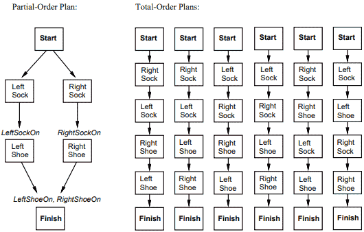

## Planning

Planning is a particular type of problem solving in which actions and goals are declaratively specified in logic and generally concerns performing actions in the real world.

Generally languages of planning problems consist mainly of  

1. States - conjunction of positive literals  

2. Goals - conjunction of positive ground literals  

3. Actions - represented in terms of precondition and effect of the action  

STRIPS and ADL are two languages used to express planning problems

|  STRIPS Language      |    ADL Language  |
|--------|----------|
|    Only positive literals in states:  $Poor ∧ Unknown$   |   Positive and negative literals in states:   $¬Rich ∧ ¬Famous$    |
|    Unmentioned literals are false   |    Unmentioned literals are unknown   |
|   Effect $P ∧ ¬Q$ means add P and delete Q   |    Effect $P ∧ ¬Q$ means add P and ¬Q and delete ¬P and Q.|
|    Only ground literals in goals:  $Rich ∧ Famous$   |    Quantified variables in goals:   $∃xAt(P1,x) ∧ At(P2, x)$   |
|   Goals are conjunctions    |   Goals allow conjunction and disjunction    |
|   Effects are conjunctions   |    Conditional effects allowed   |
|No support for equality|Equality predicate (x = y) is built in|
|No support for types|Variables can have types|
|Example : $Action(Fly(p, from,to),$ $PRECOND:At(p, from) ∧ Plane(p) ∧ Airport(from) ∧ Airport(to)$ $EFFECT:¬At(p, from) ∧ At(p,to))$ | Example : $Action(Fly(p : Plane, from : Airport,to : Airport),$ $PRECOND:At(p, from) ∧ (from = to)$ $EFFECT:¬At(p, from) ∧ At(p, to))$|

## Partial Order Planning (POP)

Any planning algorithm that can place two actions into a plan without specifying which
comes first is called a partial-order planner.

- Ordering constraints - of the form $A ≺ B$ (A before B) which means that action A must be executed sometime before action B
- Causal link - between two actions A and B in the plan is written as $A\xrightarrow{\text{p}}B$  (A achieves p for B). 
- Conflict - An action C conflicts with $A\xrightarrow{\text{p}}B$ if C has the effect ¬p and if C could come after A and before B.
- Open precondition - A precondition is open if it is not achieved by some action in the plan.

Consider the following description of planning problem :  

$Goal(RightShoeOn ∧ LeftShoeOn)$  
$Init()$    
$Action(RightShoe, PRECOND:RightSockOn, EFFECT:RightShoeOn)$  
$Action(RightSock, EFFECT:RightSockOn)$  
$Action(LeftShoe, PRECOND:LeftSockOn, EFFECT:LeftShoeOn)$  
$Action(LeftSock, EFFECT:LeftSockOn)$

Actions - ${RightSock, RightShoe, LeftSock, LeftShoe, Start, Finish}$  
Orderings - ${RightSock ≺ RightShoe, LeftSock ≺ LeftShoe}$  
Links - {${RightSock\xrightarrow{\text{RightSockOn}}RightShoe, LeftSock\xrightarrow{\text{LeftSockOn}}LeftShoe,RightShoe\xrightarrow{\text{RightShoeOn}}Finish, LeftShoe\xrightarrow{\text{RightShoeOn}}Finish}$}  
Open Preconditions - { }

## Planning Graphs

A planning graph consists of a sequence of levels that correspond to time steps in the
plan, where level 0 is the initial state.  
Each level contains a set of literals and a set of actions.

NOTE : persistence actions are actions that remain true from one situation to the next if no action alters it.

Before forming a planning graph we need to understand mutex links  
A mutex relation holds between two actions if  

1. Inconsistent effects - one action negates an effect of the other  

2. Interference - one of the effects of one action is the negation of a precondition of the
other  

3. Competing needs - one of the preconditions of one action is mutually exclusive with a
precondition of the other.  

Consider this problem : 

$Init(Have(Cake))$  
$Goal(Have(Cake) ∧ Eaten(Cake))$  
$Action(Eat(Cake)$  
$\quad$ $PRECOND: Have(Cake)$  
$\quad$ $EFFECT: ¬ Have(Cake) ∧ Eaten(Cake))$  
$Action(Bake(Cake)$  
$\quad$ $PRECOND: ¬ Have(Cake)$  
$\quad$ $EFFECT: Have(Cake))$  

In the above graph rectangles indicate actions, small squares indicate persistence actions and straight lines
indicate preconditions and effects. Mutex links are shown as curved gray lines.

> These notes can be refined