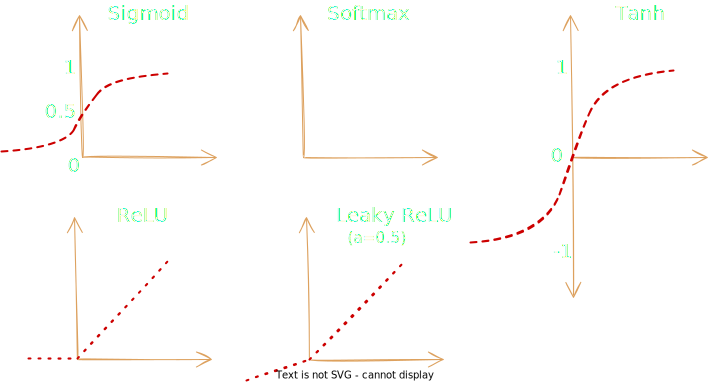

# Artifical Neural Networks

A neural network is simply made out of layers of [neurons](#neuron), connected in a way that the input of one layer of neuron is the output of the previous layer of neurons (after activation)

They are loosely based on how our human brain works. 

For more advanced concepts, refer to [Deep Learning](./../Deep_Learning/).

## Neuron

Most basic unit of a neural network

### Tasks

1. Receive input from other neurons and combine them together
2. Perform some kind of transformation to give an output. This transformation is usually a mathematical combination of inputs and application of an [activation function](#activation-functions).

### Visual representation

## MP Neuron

McCulloch Pitts Neuron

Highly simplified compulational model of neuron

$g$ aggregates inputs and the function $f$ and gives $y \in \{ 0, 1 \}$

$$
\begin{aligned}
y &= f \circ g \ (x) \\
&= f \Big( g (x) \Big)
\end{aligned}
$$

$$
y = \begin{cases}
1, & \sum x_i \ge \theta \\
0, & \text{otherwise}
\end{cases}
$$

- $\sum x_i$ is the summation of boolean inputs
- $\theta$ is threshold for the neuron

### ❌ Limitation

MP neuron can be used to represent [linearly-separable functions](#Linearly-Separable-Function)

## Perceptron

MP neuron with a mechanism to learn numerical weights for inputs

✅ Input is no longer limited to boolean values

$$
\begin{aligned}
y
&= \begin{cases}
1, & \sum w_i x_i \ge \theta \\
0, & \text{otherwise}
\end{cases} \\
\Big(
x_0 &= 1, w_0 = -\theta
\Big)
\end{aligned}
$$

- $w_i$ is weights for the inputs

### Key Terms for Logic

- Pre-Activation (Aggregation)
- Activation (Decision)

### Perceptron Learning Algorithm

## Perceptron vs Sigmoidal Neuron

|                       | Perceptron | Sigmoid/Logistic |
| --------------------- | :--------: | :--------------: |
| Type of line          | Step Graph |  Gradual Curve   |
| Smooth Curve?         |     ❌      |        ✅         |
| Continuous Curve?     |     ❌      |        ✅         |
| Differentiable Curve? |     ❌      |        ✅         |

## MLP

Multi-Layer Perceptron

Simple neural network with 3 Layers

```mermaid
flowchart LR

x1 & x2 -->
h1 & h2 & h3 & h4 -->
y

subgraph il[Input<br />Layer]
	x1 & x2
end

subgraph hl[Hidden<br />Layer]
	h1 & h2 & h3 & h4
end

subgraph ol[Output<br />Layer]
	y
end
```

For an input layer with $n$ nodes, we will have

- 1 output
- $2^n$ nodes in hidden layer

## Feed-Forward NN

NN (with $> 3$ layers) where every layer feeds forward to the next layer; backward/self-loop is not allowed

For an input layer with $n$ nodes, we will have

- $$
  hidden layers = 
  $$

- $W_i$ is the weights to layer $i$

$$
\begin{aligned}
\textcolor{hotpink}{\text{PreActivation}_{H_1}}
&= b_1 + w_1 x_1 + w_2 x_2 + \dots \\
\text{Activation}_{H_1}
&= \frac{1}{1 + e^{- \textcolor{hotpink}{\text{PreActivation}_{H_1}}}}
\end{aligned}
$$

### Decision Boundary

| Hidden Layers | Shape of Region |
| :-----------: | --------------- |
|       0       | Open            |
|       1       | Closed/Open     |
|    $\ge 2$    | Closed          |

As you increase the number of hidden layers, the possibility of open decision boundary decreases (which is good).

## Activation Functions

|                  Name                  |                        Output $f(x)$                         | Output Type |        Range        |
| :------------------------------------: | :----------------------------------------------------------: | ----------- | :-----------------: |
|                Identity                |                             $x$                              | Continuous  |      $[-1, 1]$      |
|            Binary Step            |    $\begin{cases} 0, &x < 0 \\ 1, & x \ge 0 \end{cases}$     | Binary      |      ${0, 1}$       |
|           Tariff/ Tanh            |                          $\tanh(x)$                          | Discrete    |      $[-1, 1]$      |
|                 ArcTan                 |                       $\tan^{-1} (x)$                        | Continuous  |  $(-\pi/2, \pi/2)$  |
|   ReLU (Rectified Linear Unit)    |    $\begin{cases} 0, &x < 0 \\ x, & x \ge 0 \end{cases}$     | Continuous  |    $[0, \infty]$    |
|   SoftPlus (smooth alt to ReLU)   |                        $\log(1+e^x)$                         | Continuous  |    $[0, \infty]$    |
|      Parametric/ Leaky ReLU       | $\begin{cases} \alpha x, &x < 0 \\ x, & x \ge 0 \end{cases}$ | Continuous  | $[-\infty, \infty]$ |
|      Exponential Linear Unit      | $\begin{cases} \alpha (e^x-1), &x < 0 \\ x,&  x \ge 0 \end{cases}$ | Continuous  | $[-\infty, \infty]$ |
| Sigmoid/ Logistic/ Soft Step |                    $\dfrac{1}{1+e^{-x}}$                     | Binary      |      $[0, -1]$      |
|                Softmax                 | $\dfrac{e^{x}}{\sum_{i=1}^k e^{x_i}}$ where $k=$ no of classes such that $\dfrac{\sum p_i}{k} = 1$ | Discrete    |      $[0, 1]$       |

## Back-Propagation

Occurs at every neuron

In a perceptron, it occurs only once, as there is only one neuron in the output layer