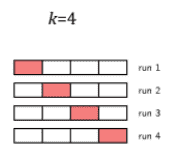
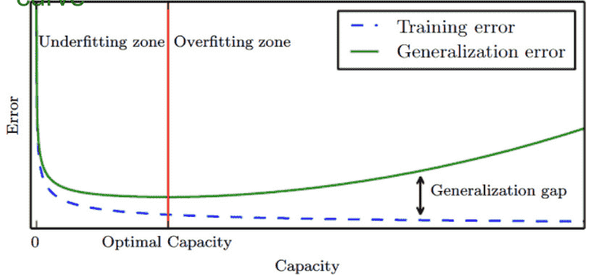

## Error Metrics

Cost/Loss Functions

### Regression

|                        Metric                        |                           Formula                            | Preferred Value |    Unit     |     Range     | Advantages ✅                          | Disadvantages ❌               | Comment |
| :--------------------------------------------------: | :----------------------------------------------------------: | :-------------: | :---------: | :-----------: | ------------------------------------------ | ---------------------------------- | :------ |
|            MAE (Mean Absolute Error)            |       $\frac{1}{n} \sum_{i=1}^n \| \hat y_i - y_i \|$        |  $\downarrow$   | Unit of $y$ | $[0, \infty)$ | Insensitive to outliers                    | Does not penalize large deviations |         |
|            MSE (Mean Squared Error)             |        $\frac{1}{n} \sum_{i=1}^n (\hat y_i - y_i)^2$         |  $\downarrow$   | Unit of $y$ | $[0, \infty)$ | Penalizes large deviations                 | Sensitive to outliers              |         |
|          RMSE (Root Mean Square Error)          |                     $\sqrt{\text{MSE}}$                      |   Same as MSE   | Unit of $y$ | $[0, \infty)$ | Same as MSE                                | Same as MSE                        |         |
|      MAPE (Mean Absolute Percentage Error)      | $\frac{1}{n} \sum_{i=1}^n \| \frac{ \hat y_i - y_i }{y_i} \|$ |  $\downarrow$   |      %      | $[0, \infty)$ | Easy to understand                         | Division by 0 error when $y_i=0$   |         |
| WMAPE (Weighted Mean Absolute Percentage Error) | $\frac{1}{n} \frac{ \sum_{i=1}^n \| \hat y_i - y_i \| }{\sum_{i=1}^n \| y_i \|}$ |  $\downarrow$   |      %      | $[0, \infty)$ | Avoids the  division by zero error of MAPE |                                    |         |
|          RAE (Relative Absolute Error)          | $\dfrac{\sum_{i=1}^n \| \hat y_i - y_i \|}{\sum_{i=1}^n \| \bar y - y_i \|}$ |  $\downarrow$   |      %      | $[0, \infty)$ |                                            |                                    |         |
|           RSE (Relative Square Error)           | $\dfrac{\sum_{i=1}^n  (\hat y_i - y_i)^2 }{\sum_{i=1}^n (\bar y - y_i)^2 }$ |                 |      %      | $[0, \infty)$ |                                            |                                    |         |
|          RSS (Residual Sum of Squares)          | $\sum_{i=1}^n \left( y_i - \left( \beta_0 + \sum_{j=1}^m \beta_j x_{ij} \right) \right)^2$ |                 |             |               |                                            |                                    |         |
|      $R^2$ (Coefficient of Determination)       |                       $1 - \text{RSE}$                       |   $\uparrow$    |  Unitless   |   $[0, 1]$    |                                            |                                    |         |
|                        Bayes                         |               Error incurred by an ideal model               |  $\downarrow$   |             |               |                                            |                                    |         |
|        SEE (Standard Error of Estimate)         |          $\sqrt{\dfrac{ \sum(\hat y - y)^2}{n-2}}$           |  $\downarrow$   |             |               |                                            |                                    |         |

Ideal model is one that making predictions from true distribution $P(x,y)$; even such a model incurs some error due to noise/overlap in the distributions

### Classification

| Metric                                              | Meaning                                                      |                           Formula                            |
| --------------------------------------------------- | ------------------------------------------------------------ | :----------------------------------------------------------: |
| **Accuracy**                                        | $\frac{\text{Correct Predictions}}{\text{No of predictions}}$ |      $\frac{\text{TP + TN}}{\text{TP + FP + TN + FN}}$       |
| **Error**                                           | $\frac{\text{Wrong Predictions}}{\text{No of predictions}}$  | $\begin{aligned} & 1 - \text{Accuracy} \\ &\frac{\text{FP + FN}}{\text{TP + FP + TN + FN}}\end{aligned}$ |
| **Recall** Sensitivity True Positive Rate | How many actual +ve values were correctly predicted as +ve   | $\frac{\textcolor{hotpink}{TP}}{\textcolor{hotpink}{TP} + \text{FN}}$ |
| **Precision** Positive Predictive Value        | Out of actual +ve values, how many were correctly predicted as +ve | $\frac{\textcolor{hotpink}{TP}}{\textcolor{hotpink}{TP} + \text{FP}}$ |
| **Specificity** True Negative Rate             | Out of actual -ve values, how many were correctly predicted as -ve | $\frac{\textcolor{hotpink}{TN}}{\textcolor{hotpink}{TN} + \text{FP}}$ |
| **F Score** F~1~ Score F-Measure          | Harmonic mean between precision and recall Close to lower value | $\frac{2 \times \text{Precision} \times \text{Recall}}{\text{Precision} + \text{Recall}}$ |
| **FP Rate**                                         | Out of the actual -ve, how many were misclassified as Positive | $\begin{aligned}\alpha &= \frac{\textcolor{hotpink}{FP}}{\textcolor{hotpink}{FP} + \text{TN}} \\ &= 1 - \text{Specificity} \end{aligned}$            |                                                              |                                                              |
| **FN Rate**                                         | Out of the actual +ve, how many were misclassified as Negative | $\begin{aligned}\beta &= \frac{\textcolor{hotpink}{FN}}{\textcolor{hotpink}{FN} + \text{TP}} \\ &= 1 - \text{Sensitivity} \end{aligned}$            |                                                              |                                                              |
| **Cross Entropy**/ Log Loss               |                                                              |        $-\sum\limits_{x \in X} P(x) \cdot \log Q(x)$         |

## Model Evaluation

We don’t test the model on the same we trained it with, because it will give high in-sample accuracy, but may give low out-of-sample accuracy(which is really what we want).

Out-of-sample accuracy is the accuracy of the model when tested when never-before-seen data.

Once the model is finalized, you should train your model with the testing data afterwards.

|                     | Type          | Purpose           |
| ------------------- | ------------- | ----------------- |
| Training evaluation | In Sample     | ❌                 |
| Validation          | Out of Sample | Model tuning      |
| Testing evaluation  | Out of Sample | Model performance |

### $k$-Fold Cross Validation

Used when dataset is too small, and hence difficult to divide dataset into a fixed training set, validation, and test sets.

- Split the dataset into $k$ random groups
  - $k$ is most commonly set as 4
  - $k$ is called as decision parameter

- $k-1$ groups are used to train and evaluated on remaining group
- Take average of all performance scores

{ loading:lazy }

## Bias & Variance

We want **low value** of both

|         |              Bias               |                       Variance                        |
| :-----: | :-----------------------------: | :---------------------------------------------------: |
| Meaning | Error rate of the training data |            Error rate of the testing data             |
| Formula |         $E[\hat y] - y$         | $E \Bigg[ \ \Big(\hat y - E[\hat y] \ \Big)^2 \Bigg]$ |

$$
\text{MSE} = \text{Bias}^2 + \text{Variance} + \text{Bayes Error}
$$

## Generalization

The ability of trained model to be able to perform well on unseen inputs. Better validation result $\implies$ Better generalization

### Generalization & Training Size

Generalization improves with size of training set, until a saturation point, after which it stops improving.

|                | More data $\implies$                                        |
| -------------- | ----------------------------------------------------------- |
| Parametric     | asymptote to an error value exceeding Bayes error           |
| Non-Parametric | better generalization until best possible error is achieved |

## Fitting & Capacity

We can control the fitting of a model, by changing hypothesis space, and hence changing its capacity

|                       | Under-fitting                                                | Appropriate-Fitting | Over-Fitting                                                 |
| --------------------- | ------------------------------------------------------------ | ------------------- | ------------------------------------------------------------ |
| Capacity              | Low                                                          | Appropriate         | Low                                                          |
| Bias                  | ⬆️                                                            | ⬇️                   | ⬇️                                                            |
| Variance              | ⬇️                                                            | ⬇️                   | ⬆️                                                            |
| Steps to address | Increase model complexity Increase training data Remove noise from data Inc no of features |                     | Cross-Validation More training data Feature Reduction Early Stopping Regularization |

The capacity of a model increases with increased [degree of polynomial](#degree-of-polynomial)

## Techniques to address fitting

### Regularization

Reduce errors by fitting the function appropriately on the given training set, to help reduce variance, and hence avoid overfitting, while not affecting bias.

This is done by adding a penalty term in the error function.

|                |                   $L_1$                   |                    $L_2$                    | $L_3$                                                        |
| -------------- | :---------------------------------------: | :-----------------------------------------: | ------------------------------------------------------------ |
| Common Name    |                   Lasso                   |                    Rigde                    | Elastic Net                                                  |
|                |     Eliminates feature(s) completely      | Reduce/Normalize the effect of each feature |                                                              |
|                |        Helps in feature selection         |         Scale down the coefficients         |                                                              |
| Error Function | $RSS + \lambda \sum_{j=1}^m \|\beta_i \|$ |   $RSS + \lambda \sum_{j=1}^m \beta_i ^2$   | $RSS + \lambda_1 \sum_{j=1}^m  + \lambda_2 \sum_{j=1}^m \beta_i ^2$ |

Contours of where the penalty is equal to 1 for the three penalties L1, L2 and elastic-net

### Bias-Variance Tradeoff

### Inc/Dec Capacity

Relationship between error & capacity is usually U-Shaped

## Degree of Polynomial

| Degree  | $\hat y =$                    |
| :-----: | ----------------------------- |
|    1    | $w_0 + w_1 x$                 |
|    2    | $w_0 + w_1 x + w_2 x^2$       |
| $\dots$ |                               |
|   $n$   | $\sum\limits_{i=0}^n w_i x^i$ |

## Nom

$\|\|$ is called as ‘nom’?

$$
||w^2|| = \sum |w^2|
$$
