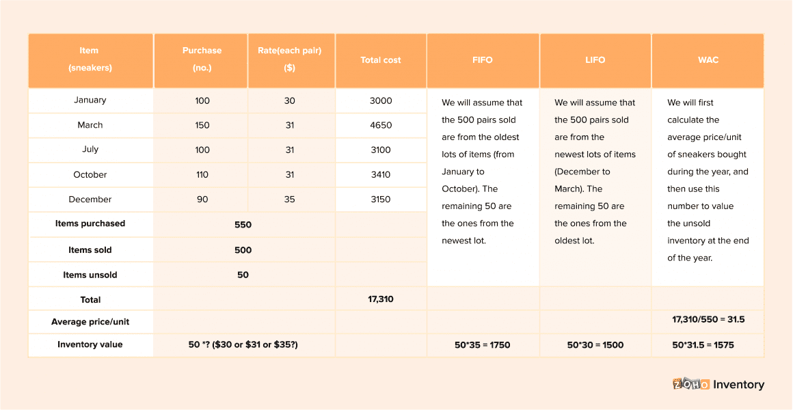

## Inventory

Assets that are either

- products for sale
- supplies

### Supplies

Tangible items that will be consumed in the course of normal operations, such as lubricants, repair parts

## Types of Companies

|Type                 | Manufacturing                                                | Merchandising                            | Service|
|---                  | ---                                                          | ---                                      | ---|
|Meaning              | Converts raw materials into finished goods                   | Sells goods in the same form as acquired | Provides intangible services|
|Example |  | Trading businesses, Grocery stores | Hotels, beauty parlors, plumbers, professional service firms (accounting firms, legal firms) |
|Inventory | Materials Work-in-progress Finished goods |  | Materials |
|Inventory costs                |  | Acquisition costs (includes cost of goods sold) |  |

## Inventory Costs

Includes

- Cost of purchase
  - Net of trade discount
  - Includes duties and taxes, freight inward
- Cost of conversion
  - Direct Labour
  - Factory Overheads (Rent, Insurance, Electricity)
- Transport costs
- Set-up costs
- Other **normal losses**

Does not include

- **Abnormal losses**
- Interest cost
- Selling and distribution overheads

### Some Special Costs

| Cost                                                         | Meaning                                                      | Example                                                      |
| ------------------------------------------------------------ | ------------------------------------------------------------ | ------------------------------------------------------------ |
| Intangible Inventory Costs Jobs in-progress/unbilled costs | Costs incurred for client but not yet billed                 |                                                              |
| Shortage Costs                                               | Costs incurred by an organization when it has no inventory in stock. | Loss of business from customers who go elsewhere to make purchases Loss of the margin on sales that were not completed Overnight shipping costs to acquire goods that are not in stock |

## Calculation of Cost of Goods Sold

| A. Cost of Goods Consumed                 |         |         |
| ----------------------------------------- | ------: | ------: |
| Opening stock of raw material             |     $a$ |         |
| \+ Purchase (including freights etc.)     |     $b$ |         |
| \- Closing Stock of raw material          |     $c$ | ==$c$== |
| **B. Cost of Goods Produced/Production:** |         |         |
| Opening Work-in-progress (WIP)            |     $d$ |         |
| \+ Cost of raw material consumed          | ==$c$== |         |
| \+ Conversion Cost                        |     $e$ |         |
| \+ Factory Overheads                      |     $f$ |         |
| \- Closing WIP                            |     $g$ | ==$g$== |
| **C. Cost of Goods Sold**                 |         |         |
| Opening Stock of Finished Goods           |     $h$ |         |
| \+ Cost of Goods Produced                 | ==$g$== |         |
| \- Closing Stock of Finished Goods        |     $i$ |     $i$ |

## Inventory Cost Methods

Valuation of unsold inventory stock when preparing financial statements

|                                  | Meaning                       | Permitted in India? | Formula                                                      |
| :------------------------------: | ----------------------------- | :----------------------: | ------------------------------------------------------------ |
| FIFO (First In, First Out)  | Items bought first sold first |            ✅             |                                                              |
|  LIFO (Last In, First Out)  | Items bought last sold first  |            ❌             |                                                              |
| WAC (Weighted Average Cost) |                               |            ✅             | $\dfrac{\sum \text{Count}_i \times \text{Rate}_i}{\text{Total Count}}$ |

